# Predicting NYC Metro Ridership: Data-Driven Insights for Smarter City Planning

## Overview

This project aims to predict **NYC transit ridership** using a combination of historical ridership data, **weather information**, and machine learning models. It explores patterns in transit usage, builds predictive tools, and provides insights to aid city planners and transit authorities in resource optimization and infrastructure planning.

## Project Goals

- **Predict hourly transit ridership** for NYC MTA subway stations.
- Analyze **temporal and geographical trends** in ridership.
- Incorporate **weather data** to understand its impact on ridership patterns.
- Use **machine learning models** like Random Forest, LSTM, and time series techniques for predictions.
- Develop tools and visualizations to provide actionable insights for transit authorities and city planners.

---

## Data Sources

### New York City Metropolitan Transit Authority (NYC MTA)
- **MTA Subway Hourly Ridership:** Comprehensive hourly ridership data beginning July 2020.  
  [Link to data source](https://data.ny.gov/Transportation/MTA-Subway-Hourly-Ridership-Beginning-July-2020/wujg-7c2s/about_data)  
  - [Data Dictionary](https://data.ny.gov/api/views/wujg-7c2s/files/41d9b5bf-aeda-4a7e-b15c-a3c5f01ee345?download=true&filename=MTA_SubwayHourlyRidership_DataDictionary.pdf)  
  - [MTA Open Data Program Licensing](https://new.mta.info/open-data)  
- **MTA Subway Stations:** List of subway stations, including identifiers, locations, and associated lines.  
  [Link to data source](https://data.ny.gov/Transportation/MTA-Subway-Stations/39hk-dx4f/about_data)

### NOAA Weather Data
- **Weather Data:** Climate summaries for Central Park, NY, including temperature, precipitation, and extreme weather events.  
  [Link to Weather Data](https://www.ncdc.noaa.gov/cdo-web/datasets)  
  - [Data Dictionary](http://www.ncei.noaa.gov/pub/data/cdo/documentation/GHCND_documentation.pdf)  
  - [NOAA Open Data Dissemination Licensing](https://www.noaa.gov/information-technology/open-data-dissemination)  

### References
1. Hightower, Ashley, et al. "A Comparison of Time Series Methods for Post-COVID Transit Ridership Forecasting." *Journal of Public Transportation*, vol. 26, 2024.  
   [Read Article](https://doi.org/10.1016/j.jpubtr.2024.100097)

---

## Methodology

### Data Cleaning and Preprocessing
Our preprocessing pipeline includes:
- Cleaning and aggregating hourly ridership data by station and borough.
- Integrating weather variables such as temperature and precipitation.
- Excluding data from the COVID-19 pandemic period to focus on stable post-pandemic trends.

### Visualization Tools
We developed interactive maps and heatmaps to analyze ridership patterns. These tools highlight:
- Daily, weekly, and seasonal trends.
- Over- and under-utilized stations.
- Peak and off-peak ridership distributions.

### Prediction Models
We implemented **LSTM neural networks** for time series forecasting, leveraging:
- Hourly ridership data for 2022 to forecast 2023 patterns.
- Contextual station features (borough, nearby attractions, and service lines).
- Evaluation metrics: Mean Absolute Error (MAE) and Symmetric Mean Absolute Percentage Error (SMAPE).

---

## Key Insights

### Findings
- **Temporal Challenges:** Peak rush hours exhibit the highest prediction errors due to dynamic commuter behavior.
- **Geographical Patterns:** Stations in the Bronx demonstrated unique prediction challenges linked to transit dependency and infrastructure variations.
- **Seasonal Variability:** Fall and spring showed the highest absolute and proportional errors, influenced by school schedules, tourism, and weather patterns.

### Recommendations
- Integrate more detailed event and economic data.
- Develop station-specific models to capture unique ridership patterns.
- Enhance feature engineering to incorporate neighborhood dynamics and transit interactions.

---

## Getting Started

### Prerequisites
1. Clone the repository:
   ```bash
   git clone https://github.com/and-jacks/mads-capstone.git
   ```
2. Create a Python environment:
   ```bash
   conda create -n mads python=3.12.4
   conda activate mads
   ```
3. Install dependencies:
   ```bash
   pip install -r requirements.txt
   ```
### LSTM Forecasting
1. Folder - EDA_LSTM run `Andrew_EDA_LSTM_Viz_Final_12.3.24.ipynb` notebook
### Visualizations
1. Folder - Visualization run `station_data.ipynb`
2. Run `trend_viz,ipynb`

### Random Forest Regressor Pipeline Steps (created but not fully utilized)
1. Run `eda_weather.ipynb` to process weather data.
2. Run `ridership_data_EDA.ipynb` to preprocess ridership data (exports a ~600MB file).
3. Run `ridership_wx.ipynb` to merge datasets (outputs a ~1GB file).
4. Run `RandomForest_model.ipynb` to train models and generate predictions and metrics.

---

## Contributions
- **Andrew Jackson:** Data pipelines and ridership forecasting.
- **Armando Medina:** Weather data integration, prediction analysis, and server setup.
- **Lydia Schrandt:** Interactive visualizations, nearby attractions integration, and report drafting.

---

## Ethical Considerations
- **Data Privacy:** Ensuring transparency in data collection and avoiding misuse for surveillance.
- **Equity in Modeling:** Addressing potential biases to prevent further marginalization of underserved communities.

---

## Appendix
- Event data exploration was excluded due to challenges in data quality and geospatial precision, though future iterations may incorporate a refined event dataset for enhanced prediction accuracy.
- Random Forest Model provided great results, but decided that LSTM was a better fit for our project. 
---

------------------------------------------------------


## Data Processing and Modeling flow

```mermaid
graph TB;
    A([Data Processing and Modeling]):::folder
    A --> B([Downloaded Raw Data]):::folder
    
    B --> B1[(Hourly Ridership Data: df_filled_22.pkl, df_filled_23.pkl)]:::file
    B --> B2[(Weather Data: weather_data_ny.csv)]:::file
    
    B1 --> C1[[Process Ridership Data: ridership_data.ipynb]]:::notebook
    C1 --> D1[(Ridership Cleaned Data: ridership_long.csv)]:::file
    
    B2 --> C2[[Process Weather Data: weather_eda.ipynb]]:::notebook
    C2 --> D2[(Weather Cleaned Data: weather_data_cleaned.csv)]:::file
    
    D1 --> E[[Merge Datasets: ridership_weather.ipynb]]:::notebook
    D2 --> E
    
    E --> F[(Final Merged Data: ridership_weather.csv)]:::file

    F --> G[[RandomForest Model: RandomForest_model.ipynb]]:::notebook
    G --> H1[(Predictions: predictions_ridership.csv)]:::file
    G --> H2[(Station Metrics: stations_metrics.csv)]:::file

      H1 --> J[[Visualizations]]:::notebook
    H2 --> J

    classDef folder fill:#444444,stroke:#333,stroke-width:2px;
    classDef file fill:#336699,stroke:#333,stroke-width:2px;
    classDef notebook fill:#8b4513,stroke:#333,stroke-width:2px;
```



